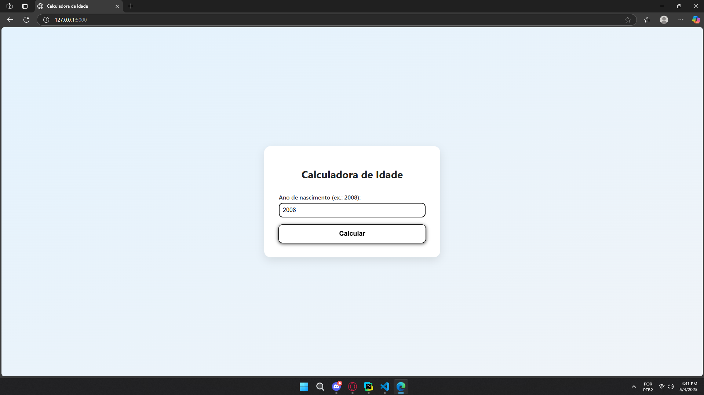

# calculadora-idade

Aplicação com Flask que cuja função é retornar a idade de um indivíduo a partir do ano de nascimento fornecido pelo usuário.

## Como utilizar
Insira o ano de nascimento no campo e obtenha a idade. Segue o exemplo:

